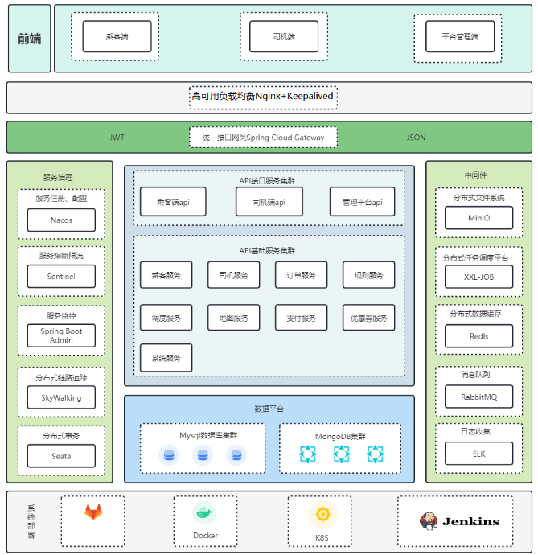
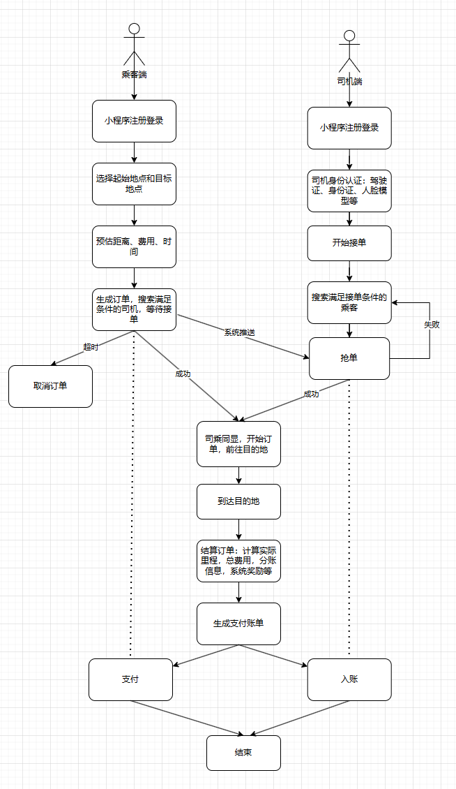
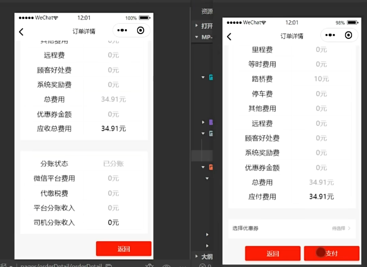
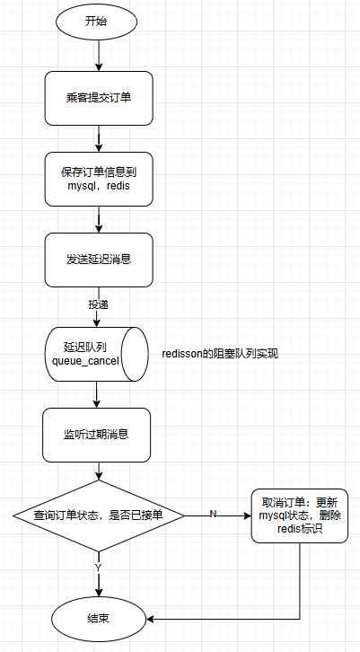
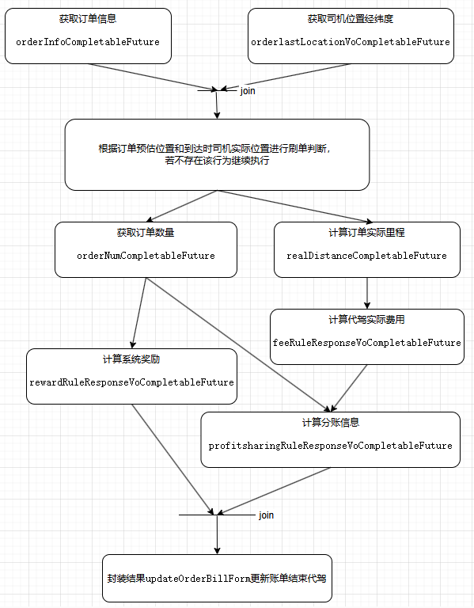

## DriveX

### 前言

具体文档持续更新：[DriveX](https://www.yuque.com/jyafoo/javanotes/btgrewa9r39ncvmd?singleDoc#)

### 项目描述
作为基于微服务架构下的出行打车平台，为高效协调用户与司机之间的之间的需求和供给，将应用拆分为多个独立的服务进行编码，包括用户服务、司机服务、调度服务、支付服务等，每个服务都可以独立部署和扩展，以保证服务的高性能高可用性。

### 技术架构
技术架构如图所示：

主要使用技术如下：
- SpringBoot：简化Spring应用的初始搭建以及开发过程
- SpringCloud&SpringCloudAlibaba：基于Spring Boot实现的云原生应用开发工具
- MyBatis-Plus：持久层框架，也依赖mybatis
- Redis：内存做缓存
- MySQL：关系型数据库
- MongoDB: 分布式文件存储的数据库
- RabbitMQ：消息中间件；大型分布式项目是标配；分布式事务最终一致性
- Seata：分布式事务
- Drools：规则引擎，计算预估费用、取消费用等等
- XXL-JOB: 分布式定时任务调用中心
- Docker：容器化技术;  生产环境Redis（运维人员）；快速搭建环境
- MinIO（私有化对象存储集群）：分布式文件存储 类似于OSS（公有）
- Knife4J/YAPI：Api接口文档工具

### 业务流程
流程如下图：

具体演示：

### 相关问题
1. 订单监控表（order_monitor）和订单监控记录表（order_monitor_record）之间的关系？
    - 待补充
2. 订单账单表（order_bill）和订单分账表（order_profitsharing）之间的关系？
    - 账单包含里程费、路桥费、停车费等相加的总费用，表示乘客应该支付的钱，司机和乘客都可见；而分账表示司机在收到这笔钱之前需要经过平台、税收等第三方抽利的信息，仅司机可见。如下图：

      

3. 回调微信异步通知接口的作用？
    - 在用户完成支付后，微信服务器会向商户服务器发送支付结果通知，确认支付结果等

### 亮点分析
#### Geo 实现位置的存储与搜索
| Situation（情境） | 在项目中，需要实现司机与乘客位置的实时存储与搜索功能。 |
| --- | --- |
| Target（目标） | 利用Redis的Geo功能存储司机的实时位置信息，并在乘客下单时快速匹配合适的司机。 乘客的经纬度不需要存储，在搜索附近司机时传入即可。 |
| Action（行动） | 1. 当司机准备接单时，将经纬度信息封装到point对象中并存储到Redis数据库，key为"`driver:geo:location:司机id`"。 2. 当乘客下单时，实现一个匹配算法，通过Redis的Geo功能搜索并匹配最近的司机。 3. 司机接单后，编写功能从Redis中移除坐标信息。 |
| Result（结果） | 项目成功实现了司机位置的实时更新和查询，显著提高了代驾服务的响应速度和匹配效率。 |
| Question（问题） |  |

####  Drools 预估乘客订单数据，计算司机分账信息、司机接单奖励
| Situation（情境） | 乘客在代驾服务平台选择起始点和目的地后，平台需要预估订单金额。 司机完成代驾服务后，平台需要计算司机的分账信息和可能的接单奖励。 |
| --- | --- |
| Target（目标） | 利用规则引擎自动化和优化订单金额预估、司机分账和奖励计算流程。 |
| Action（行动） | 1. 预估乘客订单数据：当乘客选择完起始地点和目的地点时会发起请求调用腾讯地图api查询距离，时间；通过距离预估订单金额数据，包括起步价(19元(含3公里))，里程费(4元/1公里)，远途费(超出12公里后每公里1元)等信息，最后计算总金额。 2. 计算司机分账信息：司机结束代驾之后，会计算分账信息，平台根据本订单金额、当天完成单数等规则进行比例抽成。 3. 计算司机接单奖励：司机结束代驾之后，会汇总当天完成单数进行相应的奖励，比如每天完成5单后 每单奖励2元；每天完成10单后 每单奖励5元等。 |
| Result（结果） | 处理复杂的业务逻辑，提高计算准确性和响应速度。 |
| Question（问题） |  |

#### xxl-job 实现乘客下单搜索附近司机
| Situation（情境） | 乘客下单后，系统需要在15分钟内持续搜索附近的司机资源。 |
| --- | --- |
| Target（目标） | 快速响应乘客需求，实现高效的司机搜索匹配流程。 |
| Action（行动） | 1. 利用xxl-job实现分布式任务调度。   2. 设置任务执行策略和超时机制。   3. 实现任务执行过程的可视化监控。   4. 配置错误处理和通知机制。 |
| Result（结果） | 提高了司机搜索匹配的效率，保证乘客能够在最短时间内得到服务，并通过快速的错误响应机制提高了系统的稳定性。 |
| Question（问题） |  |

#### ttl+死信队列实现订单超时取消
| Situation（情境） | 乘客下单后，需要在15分钟内找到司机，否则订单需要自动取消。 |
| --- | --- |
| Target（目标） | 实现订单超时自动取消机制，提高系统效率和用户体验。 |
| Action（行动） | 1. 当乘客下单后，会生成订单信息，并发送一个定时十五分钟的延迟消息到阻塞队列。 2. 在RedisDelayHandle 会监听过期消息，一旦获取到超过十五分钟后没有司机接单的订单，便会在 orderCancel 中更新订单状态为未接单。 3. 同时删除redis中的订单标识。 |
| Result（结果） | 订单在超时后自动取消，保证了用户满意度，提高系统效率。 |
| Question（问题） |  |

流程图如下：

#### 分布式锁解决司机抢单的并发问题
| Situation（情境） | 乘客下单搜索到附近满足接单条件的司机后（此时司机点击开始接单，为接单状态），多位司机可能同时抢单，需要确保只有一个司机能成功接单。 |
| --- | --- |
| Target（目标） | 确保抢单操作的原子性和一致性，保证订单状态的正确更新。 |
| Action（行动） | 1. 使用Redisson实现分布式锁。 2. 司机尝试接单时获取锁并进行双重检查。 3. 抢单成功后记录司机ID并更新订单状态。 4. 释放分布式锁。 |
| Result（结果） | 抢单操作的原子性和一致性得到保证，避免了订单被重复接单的问题。 |
| Question（问题） |  |

#### Mongodb 批量存储订单位置信息
| Situation（情境） | 需要实时跟踪司机位置并计算实际行驶距离，司机端应用收集位置数据。 |
| --- | --- |
| Target（目标） | 批量存储位置数据，减少数据传输频率，简化数据处理流程。 |
| Action（行动） | 1. 司机端应用实时收集位置信息。 2. 定时批量上传位置数据到后台服务。 3. 后台服务将数据存储到MongoDB中。 4. 从MongoDB中提取数据，计算总行驶距离。 |
| Result（结果） | 降低了网络负载，提高了结束订单时数据处理效率和准确性。 |
| Question（问题） |  |

#### CompletableFuture 实现任务异步编排
| 要素 | 描述 |
| --- | --- |
| Situation（情境） | 司机结束订单时需要进行数据结算和接口调用，同步执行效率低。 |
| Target（目标） | 提升执行效率和接口响应速度。 |
| Action（行动） | 1. 使用`CompletableFuture`进行异步编排。 2. 创建自定义线程池管理异步任务。 3. 异步执行获取订单信息、计算里程和费用等任务。 4. 等待所有异步任务完成后，封装结果并更新账单。 |
| Result（结果） | 将总耗时从1360毫秒优化到800毫秒。 |
| Question（问题） |  |

任务的编排步骤：

#### rabbitmq 实现支付后异步存储，seata 解决分布式事务问题
| Situation（情境） | 订单支付成功后，需要跨多个服务更新支付信息和状态。 |
| Target（目标） | 确保支付后操作的可靠性，提高系统性能，保证ACID 属性。 |
| Action（行动） | 1. 在支付成功后，立即调用微信提供的异步通知接口，以确认支付结果。并将支付成功的事件发布到 RabbitMQ。 2. 异步调用订单服务进行订单状态的更新和司机服务进行系统奖励的更新。 3. 使用Seata管理分布式事务。 |
| Result（结果） | 异步化，提高了系统的整体性能，操作一致性和数据完整性得到保证。 |
| Question（问题） |  |
 
### 难点分析 
1. 普遍在于业务流程上的理解，如结束订单时的异步调用等
