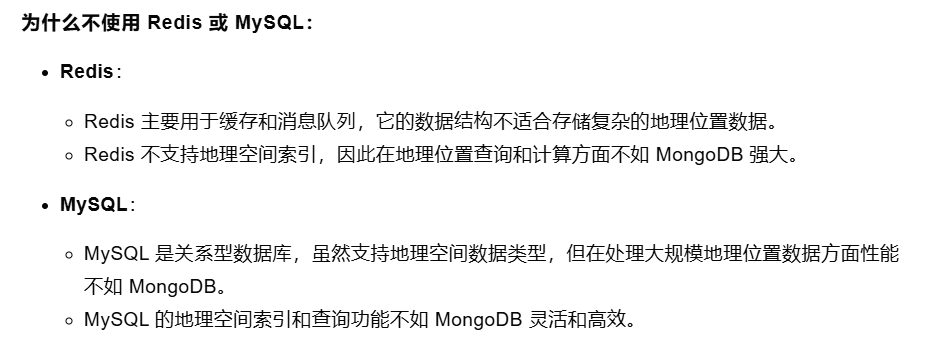

## DriveX

### 项目描述
作为基于微服务架构下的出行打车平台，为高效协调用户与司机之间的之间的需求和供给，将应用拆分为多个独立的服务进行编码，包括用户服务、司机服务、调度服务、支付服务等，每个服务都可以独立部署和扩展，以保证服务的高性能高可用性。

### 技术架构
技术架构如图所示：

主要使用技术如下：
- SpringBoot：简化Spring应用的初始搭建以及开发过程
- SpringCloud&SpringCloudAlibaba：基于Spring Boot实现的云原生应用开发工具
- MyBatis-Plus：持久层框架，也依赖mybatis
- Redis：内存做缓存
- MySQL：关系型数据库
- MongoDB: 分布式文件存储的数据库
- RabbitMQ：消息中间件；大型分布式项目是标配；分布式事务最终一致性
- Seata：分布式事务
- Drools：规则引擎，计算预估费用、取消费用等等
- XXL-JOB: 分布式定时任务调用中心
- Docker：容器化技术;  生产环境Redis（运维人员）；快速搭建环境
- MinIO（私有化对象存储集群）：分布式文件存储 类似于OSS（公有）
- Knife4J/YAPI：Api接口文档工具
- Redisson：基于redis的Java驻内存数据网格 - 框架；操作redis的框架
- ThreadPoolExecutor+CompletableFuture：异步编排，线程池来实现异步操作，提高效率
- Lombok: 实体类的中get/set 生成的jar包
- Natapp：内网穿透

### 业务流程
流程如下图：

具体演示：

### 相关问题
1. 订单监控表（order_monitor）和订单监控记录表（order_monitor_record）之间的关系？
    - 不知道
2. 订单账单表（order_bill）和订单分账表（order_profitsharing）之间的关系？
    - 账单包含里程费、路桥费、停车费等相加的总费用，表示乘客应该支付的钱，司机和乘客都可见；而分账表示司机在收到这笔钱之前需要经过平台、税收等第三方抽利的信息，仅司机可见。如下图：

      

3. 回调微信异步通知接口的作用？
    - 在用户完成支付后，微信服务器会向商户服务器发送支付结果通知，确认支付结果等

### 亮点分析 
1. 通过 redis 的 geo 实现司机与乘客位置的存储与搜索，实现即时位置查询和更新
- 具体流程： 
    - 当司机点击开始接单时会将司机经纬度封装到point中存储到redis(key为"driver:geo:location:司机id")中，当乘客点击下单时进行匹配合适的司机，当司机接单后将其坐标信息从redis中移除
- 相关问题：
    - geo 底层原理？
    - 待补充..

2. 通过 Drools 规则引擎预估乘客订单数据，计算司机分账信息、司机接单奖励
- 具体流程：
    - 预估乘客订单数据：当乘客选择完起始地点和目的地点时会发起请求调用腾讯地图api查询距离，时间；通过距离预估订单金额数据，包括起步价(19元(含3公里))，里程费(4元/1公里)，远途费(超出12公里后每公里1元)等信息，最后计算总金额
    - 计算司机分账信息：司机结束代驾之后，会计算分账信息，平台根据本订单金额、当天完成单数等规则进行比例抽成
    - 计算司机接单奖励：司机结束代驾之后，会汇总当天完成单数进行相应的奖励，比如每天完成5单后 每单奖励2元；每天完成10单后 每单奖励5元等
- 相关问题：
    - 待补充..

3. 通过 xxl-job 实现乘客下单搜索附近司机，使定时任务执行策略更丰富、执行过程可视化、错误更快被发现与定位
- 具体流程：
    - 当乘客点击下单后，会有一个十五分钟的搜索过程，此时xxl-job会开启分布式任务每秒钟搜索一次附近满足条件可以接单司机，直到有司机接单才会停止任务，或者超时
- 相关问题：
    - 待补充..

4. 使用mq的ttl+死信队列实现订单的超时取消，保证系统可靠性并且提高效率
- 具体流程：当乘客下单后，会生成订单信息，并发送一个定时十五分钟的延迟消息到阻塞队列，在RedisDelayHandle会监听过期消息，一旦获取到超过十五分钟后没有司机接单的订单，便会在 orderCancel 中更新订单状态为未接单，同时删除redis中的订单标识

- 相关问题：
    - 其他解决方案？没想到
    - 怎么保证幂等？
    - 消息丢失怎么办？
    - 超时订单的处理？统计即可，不用处理

5. 通过 Redisson 分布式锁解决多位司机抢单时的并发安全问题，确保抢单操作的原子性和一致性
- 具体流程：
    - 当乘客下单后搜索到附近满足接单条件的司机后(此时司机点击开始接单，为接单状态)，司机端会弹出乘客的订单信息，但由于是对附近司机的搜索，此时可能会有多位司机同时抢单，解决方案为使用分布式锁以订单id为key进行抢单，同时在获取锁后进行double check，记录司机id并修改订单状态算抢单成功
- 相关问题：
  - 其他实现方案？没想到

6. 使用 mongodb 批量存储订单位置信息，减少数据整合的复杂性
- 具体流程：
  - 由于到达目的地时需要计算实际行驶距离，于是司机开始代驾之后，司机端会实时收集司机代驾位置，定时批量上传位置到后台服务，保存到mongodb中，最后计算每两个坐标之间的距离进行累加
- 相关问题：
  - 为什么不用redis或mysql存？

    

7. 通过自定义线程池结合 CompletableFuture 实现订单数据的异步编排，将总耗时从 460ms 左右优化到 150ms 左右，提高接口响应速度
- 具体流程：当司机结束订单时会进行相关数据的结算及接口调用，如果同步执行效率会很低，于是引入CompletableFuture对相关的流程进行异步编排，提高执行效率。具体流程如下图：
  
  

- 相关问题：
    - 需要改成fork join框架实现？待重构
    - 线程池核心参数？
    - 怎么定义的线程池？

8. 支付成功后，使用 rabbitmq 实现支付后异步存储，并通过 seata 解决分布式事务问题
- 具体流程：
    - 当订单支付成功后，需要更新支付相关信息(状态，时间)并回调微信异步通知接口(作用是在用户完成支付后，微信服务器会向商户服务器发送支付结果通知，确认支付结果等)，然后异步调用订单服务进行订单状态的更新和司机服务进行系统奖励的更新，同时使用分布式事务保证acid
- 相关问题：
  - 分布式事务的解决方案有哪些？
  - 待补充..
 
### 难点分析 
1. 普遍在于业务流程上的理解，如结束订单时的异步调用等
